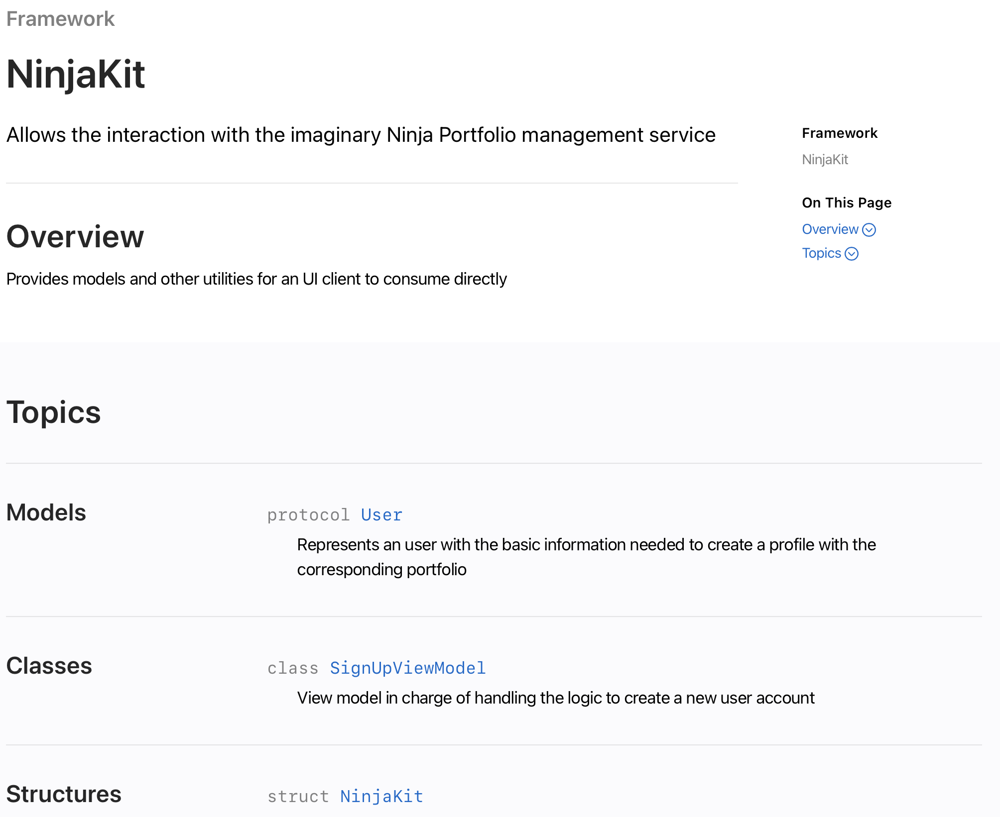
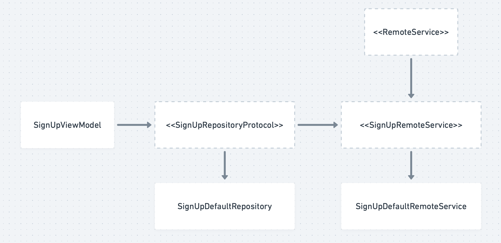
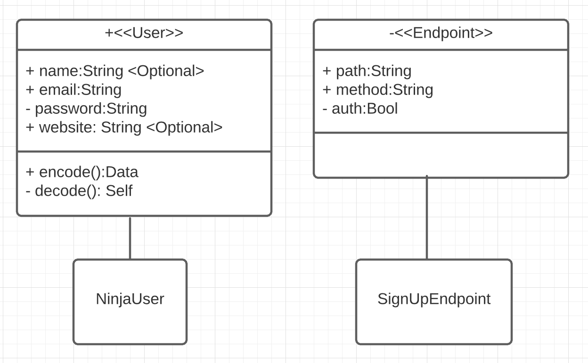

# NinjaKit 🥷🤖

This Package is in charge of handling the business logic layer for our clients.

- To run the tests open the `Package.swift` file with xcode directly.
- I built the documentation using the new DocC
it can be viewed directly in Xcode or by opening the `.docarchive` file:

- Normally I store this inside its own repository, but for the purpose of
this execise I'm just embeding it inside the same repo.

- I'm using MVVM architecure and everithing is protocol oriented, so I can easily change the implementations and get an excellent level of testability.

## Architecture overview:

- The default remote service, repository and viewmodel are tested.

- `RemoteService` is an interface that all remote services conform to, in order to manage from a single place task execution, common error handling and sometimes request building operations.

- Each part of the architecture has its own error type associated to compose them all the way to the UI.

- The only public type is the viewmodel. 

## Models overview

- For this exersise I created two models `User` and `Endpoint`.
- The `User` model is implemented as a protocol and is public.
- The internal implementation is `NinjaUser` which is also codable.
- `Endpoint` is an internal model used to manage the different services endpoint information.
- For this exersice I'm only creating one `SignUpEndpoint` with some sample information.

- A complete implementation would need support for a query, different content types, etc.