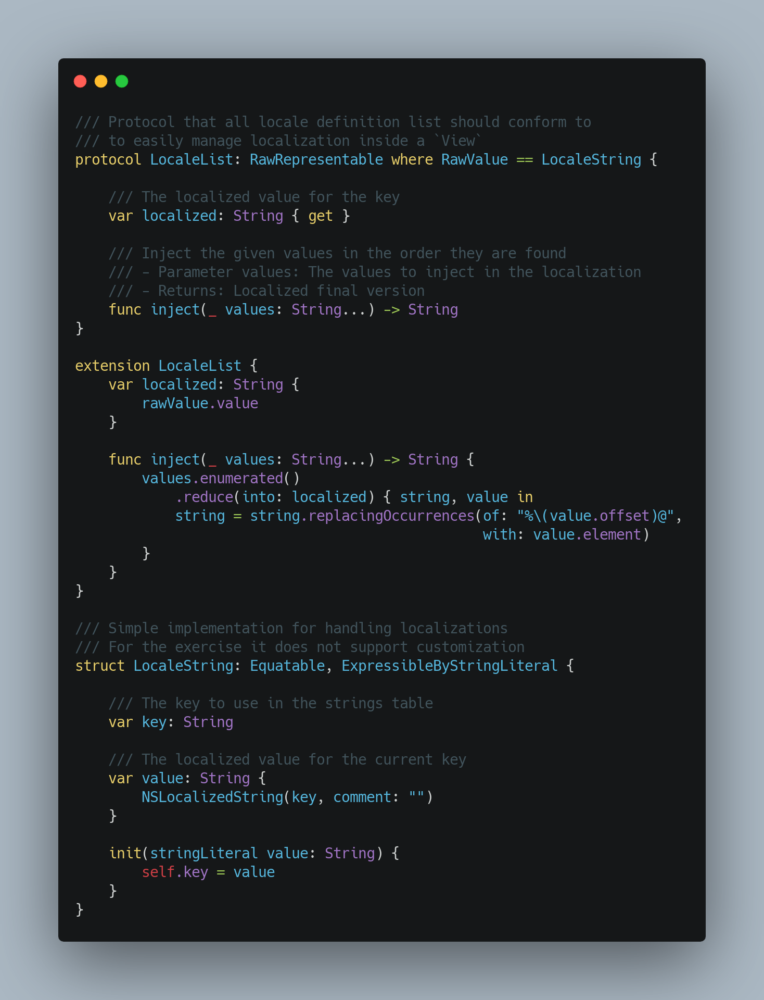
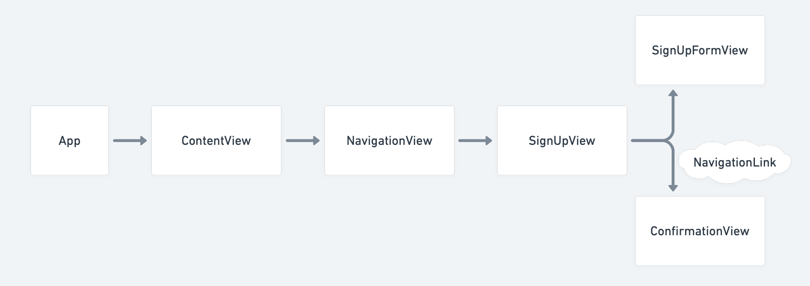

# NinjaUI 🥷📱
This client is an iOS/iPadOS application that consumes the services provided by `NinjaKit`

- The UI framework I used is SwiftUI.
- I'm using the new *SwiftUI Life Cycle* since this is a very simple app. 
- The colors are managed in the assets catalog and accesed through a Color extension file for easier maintenance.
- On this side of the project I put special effort in the localization handling of strings, to allow injection and because  `LocalizedStringKey` from `SwiftUI` was not helping me:

## View Structure

- Each view manages its own set of localized strings, the sample would be applied for accesibility.
- I decomposed the `SignUpView` and the `SignUpFormView` to remove the dependency of `NinjaKit`, make the file smaller and to focus on the UI logic.